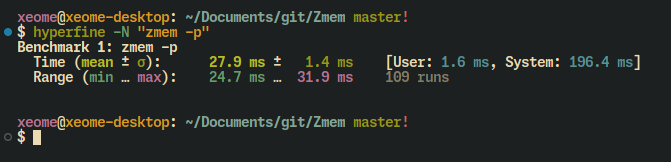

### zmemc is fork of zmem

supported compilers: clang, gcc

supported cpu architectures: amd64, i386

rest of README is modified README of zmem.

# zmemc: Linux Memory Monitoring

zmemc is a tool for monitoring virtual memory on Linux systems, focused specifically on swap usage. With detailed per-process swap usage and zswap statistics like compression ratio and zswap compressed cache, zmemc helps keep track of your system's memory usage and optimize performance.

> [!WARNING]
> This program is a work in progress and may contain bugs. Use at your own risk.

## Installation

```sh
git clone https://github.com/7244/zmemc
cd zmemc
make release
```

## Usage

To use zmemc, simply run the command below in your terminal:

```bash
./zmemc
```

or if you want per-process swap usage:

```bash
./zmemc -p
```


## Contributing

We welcome contributions from the community to improve zmemc. If you have any ideas for new features, suggestions for improvements, or you have discovered a bug, please feel free to open an issue or submit a pull request.

When submitting pull requests, please make sure that your code adheres to the project's coding standards and guidelines. This project is performance-sensitive, so it is important to ensure that any changes do not negatively impact performance.

You should benchmark your changes to ensure that they do not introduce any performance regressions. If you are adding a new feature, please include tests to ensure that it works as expected and does not break existing functionality.

Example benchmark:

```sh
hyperfine './zmemc -p'
```

results:



Before making any significant changes to the project, it is best to open an issue and discuss your proposal with the project maintainers. This will help you get feedback, ensure that your changes align with the project's goals, and avoid duplicating work.

Thank you for your interest in contributing to zmemc. Your help is appreciated, and we look forward to working with you.

## License

zmemc is licensed under the GPL3 License. See [LICENSE](LICENSE) for more information.

Thank you for using zmemc!
